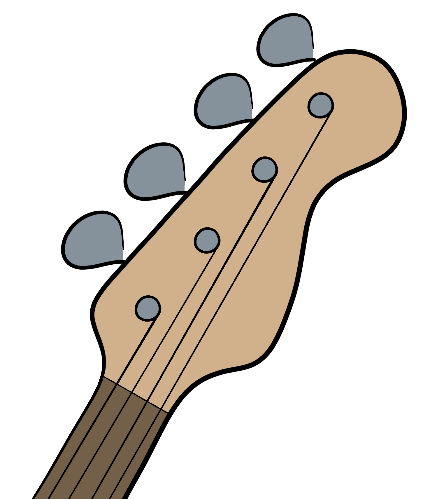
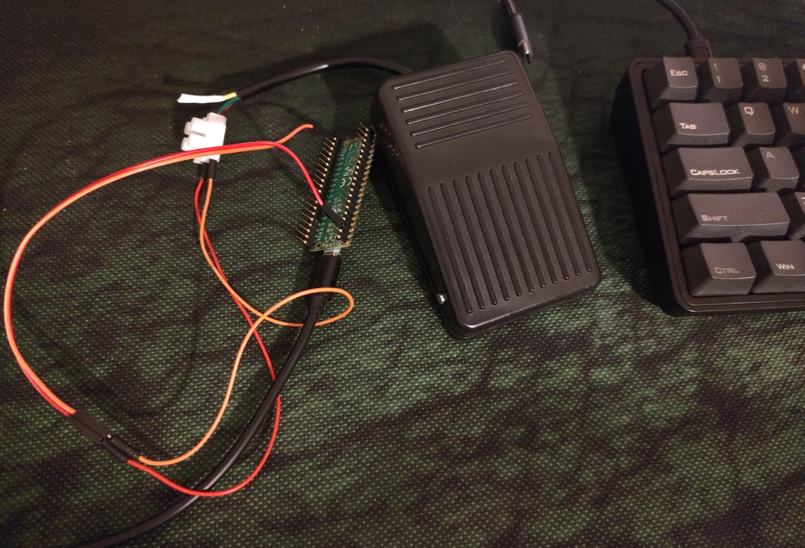
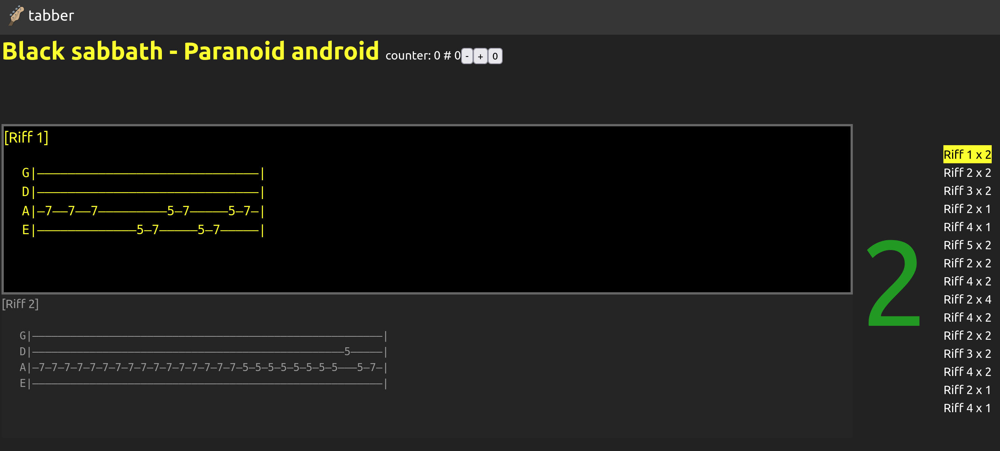

 

# Tabber - The bass playing companion

## Status: usable locally, but not yet deployment ready

Do you like to play bass, but gets lost on how many times you have repeated the riff?
Me too!!!

No more of that with tabber.

Here is how it works:
You select a tab, click on play.
If the tab has time signature, it will show the option to auto play. 

It will show you the current riff, next one, how many repetitions you still have, and a list of the whole song structure.

Once you play the riff, press the ArrowDown key to move to the next one
If you made a mistake, press the ArrowUp key to go back
To restart the song, click the button restart


# Hardware OPTIONAL!

Obviously pressing a key in your laptop is not very pratical while schredding on your bass
That is why I built a pedal to make it easier to pass to the next riff



The code is in the folder pedal
for that you will need:
- Raspberry PI pico
- cheap pedal (6 euros from china)
- wires
- usb cable

~~for more info check my blogpost about it~~ (not available yet)

or you can also buy it online for 30 EUR or less

# Setup
clone this repo:
```bash
git clone https://github.com/tiagodll/tabber.git
```

open that folder and type

```bash
dotnet restore
```

# Software

This app was written in F# with bolero.
There is a very minimal server side code (folder tabber.Server), and a rich client side (tabber.Client).



## Running the code
enter the folder tabber/src/tabber.Server and then
```
dotnet run
```
now browse [https://localhost:5001](https://localhost:5001/) or [http://localhost:5000](http://localhost:5000)

## Contributing to this project

if you find a problem in the project, create an issue in this git

if you want to help to fix a bug, create a branch and make a pull request

if you want to add a feature, please get in contact before creating a branch.
This is an open source project, but features have to be maintained, so not all the features can be added without considering how it affects the maintainability of the project.

# Good luck and rock on 🤘
